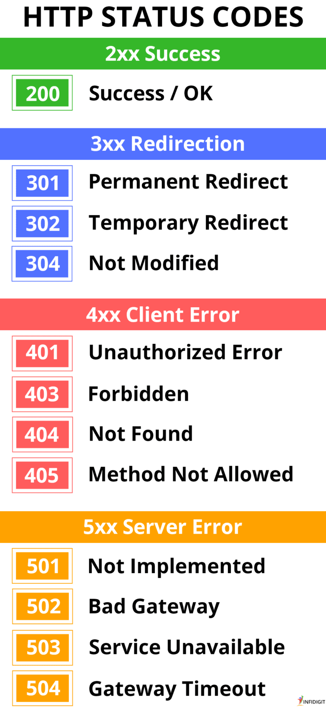

# Rest api interview questions

## 1. What is Rest API?
A REST API (Representational State Transfer API) is a set of rules for building web services that allows systems to communicate over the web using standard HTTP methods. Key features include:

1. Statelessness: Each request is independent, with no client session stored on the server.
2. Resources: Resources (like users or orders) are identified by URIs (e.g., /users/123).
3. HTTP Methods: Common methods include:
    - **GET**: Retrieve data
    - **POST**: Create new data
    - **PUT**: Update existing data
    - **DELETE**: Remove data
4. Data Formats: Typically uses JSON or XML for data exchange.

REST APIs are commonly used for building scalable and flexible web services.

## 2. What is the differences between get, post, put, delete methods.
- **GET** is for retrieving data.
- **POST** is for creating data.
- **PUT** is for updating or creating data.
- **DELETE** is for removing data.

## 3. What is the differences between put, patch methods.
- **PUT**: Replaces the entire resource with the provided data .i.e entire resouce is needed for update if not found then the resource is created.
- **PATCH**: Partially updates the resource with only the specified changes .i.e entire resouce is not needed, only get what need to update.

## 4. What is Idempotence?
It means performing a operation multiple times gives the same result.
E.g Sending multiple identical get requests will always return same result.

## 5. What are the roles of status codes?
Status codes are used to convey the result of client's request.

## 6. What is CORS?
CORS (Cross-Origin Resource Sharing) is a security feature in web browsers that controls how resources can be requested between different domain. It allows or restricts cross-origin requests by using specific HTTP headers:

- Access-Control-Allow-Origin: Specifies which domains can access the resource.
- Access-Control-Allow-Methods: Lists the HTTP methods allowed for cross-origin requests.
- Access-Control-Allow-Headers: Specifies which headers are allowed.
- Access-Control-Allow-Credentials: Indicates if credentials (cookies, etc.) are allowed.

CORS helps protect users by preventing unauthorized cross-origin requests while allowing legitimate ones when configured correctly.

## 7. What is serialization and deserialization?

Serialization: Converts an object to a storable/transmittable format (like JSON).
Deserialization: Converts the formatted data back into an object.

> [!NOTE] 
> **APIs are created using, JAVA, python, and JS and everyone handles object differently, therefore we convert a object to JSON, then we send them**

