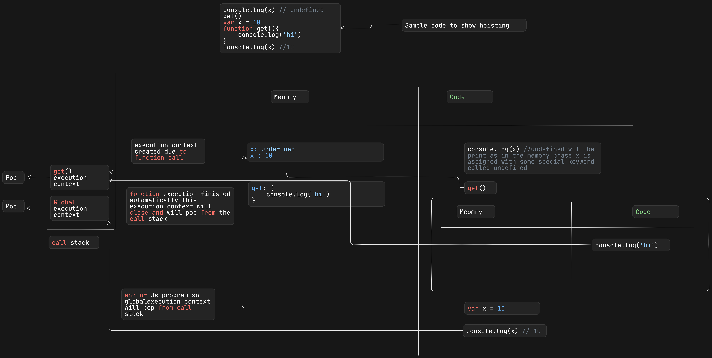
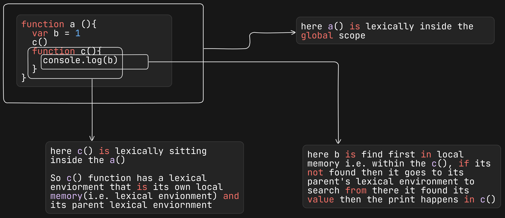
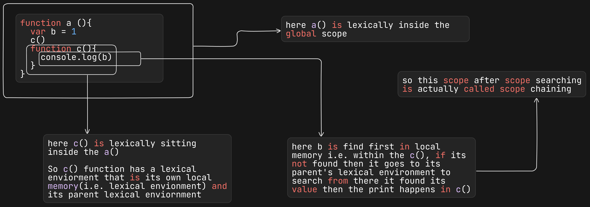

# Javascript interview-questions

## 1. What is Javascript?
Javascript is a high-level, interpreted (execute line by line) programming language, widely used in web development.

## 2. What is the execution context in JavaScript?
Execution context is an environment where the javascript code is executed. It has two sections: memory component (known as variable environment) and code component (threads of execution)

```javascript
var a; // declaring a
console.log(a); // output: undefined
a=10
console.log(a)
```
So when this code runs, then the Global execution context is created and in the memory components first the variable 'a' is allocated with a memory, and the value is set to 'undefined'. 

After memory allocation is done, then line-by-line code is executed in the first log 'undefined' will show as it has no other value, then in next line 'a=10', so the log will print as 10


## 3. Types of execution context in JavaScript?
 - Global execution context: It is created when js code starts running, it represents the global scope and global object(e.g window in browser). The 'this' keyword mainly refers to the global object.
 - Functional Execution context: It is created whenever a function is called or invoked. Each function call generates a new execution context. The 'this' keyword within a function context refers to the object that is invoked in that function.
 - Eval execution context: Created when the 'eval' function is used to execute a string of code. This execution context is generally avoided due to security and performance issues.

 ## 4. What is the shortest js program?
 An empty javascript file is the shortest JS program.

 ## 5. Code example of how execution context works.
```javascript
var n=2
function square(num){
    var ans = num * num
    return ans
}
var sq1 = square(n)
var sq2 = square(4)
```
The execution context is created with 2 phases, **Memory creation phase and code execution phase**.
So when this example code starts running, 1st phase, the **memory creation phase** started, so in the code ---

- **n: undefined** // undefined is a special keyword to show that the variable is not empty, but has a special default value.

Next comes the function

- __square: {...}__ // function square(num){
    var ans = num *num
    return ans
}

For function, the whole code is stored in the memory

- **sq1: undefined**
- **sq1: square(n)** // when the function is invoked
- **sq1: 4** // after getting the result from the function and functional execution context is removed automatically

- **sq2: undefined**
- **sq2: square(4)**  // when the function is invoked
- **sq2: 16** // after getting the result from the function and functional execution context is removed automatically

Now the **code execution phase** starts

**var n =2** // now the undefined value will be replaced by the value of n i.e. 2
Then comes the function definition, nothing to do here, so go to the next line

**Now the function invocation or call happens in the line sq1 = square(n), so for function invocation a new mini program starts and a new execution context is created under the global execution context**

In that particular execution context again 2 phases will come memory phase and code execution phase in the result, the **ans variable** returns the value and then the execution context is deleted

**For the next function invocation, the same thing will happen i.e., creation of a new execution context, and after return the result execution context will be deleted**

*Atlast when all the code is executed, then global execution is automatically deleted*


## 6. What is call stack?
When a javascript program starts execution, then a stack is also populated with the global execution context and the global execution context is stored in that stack, also when a function is invoked, then a new execution context is generated and it is placed in the stack. after the function returns its value the execution context will be removed automatically, by **popping** from the stack. When the whole js program execution is completed then the global execution context is also removed from the stack by pop. This stack is called call stack.

*Call stack maintains the execution of the execution contexts*

**Call stack can be known as different names**
- Call stack
- Execution control stack
- Program stack
- Runtime stack
- Machine Stack


## 7. What is hoisting in JavaScript?
Hoisting is a phenomenon/situation in javascript where a varible or function can be accessed before its initialization.

e.g 
```javascript
console.log(x)
get()
var x = 10
function get(){
    console.log('hi')
}
console.log(x)
```
Here in this code, we can easily understand the hoisting

- In the memory allocation phase **x is defined as undefined** and the **get() whole code is stored**
- In the code execution phase console.log(x) is there, here x already has a special value undefined so the undefined prints.
- **In the code execution phase this x variable is not initialized, but in the memory allocation phase we can see x variable has some memory with undefined stored in it. So var is in the global scope, if the variable is declared then the var can be called from anywhere. In this case, the var variable is called before its initialization, so undefined returns.**
- In the case of a function, the whole code is stored during memory allocation time, when the function is called then a new execution context is created, and it has its own memory and code phase. After the function ends its execution, the execution context is also deleted and returns to the global execution context.
- In the last line of code again console.log(x) is written and this time it returns 10 because the variable is already initialized with a new value.



## 8. What is the difference between undefined and not defined?
- When a variable is mentioned in the js code and during memory allocation phase the variable got a special type of placeholder/keyword called **undefined** and before initialize the variable if it needs to print then **undefined** will print.
- When a variable is called in the js code, and that variable is never mentioned in the js code, so the memory allocation did not happen, then we can say that variable is **not defined**. Also js sends a error message that particular variable is **not defined**

## 9. Is JS a loosely type / weakly typed language?
Javascript is a loosely type language, because when a variable has some value, then that variable does not attaches any data type with it.
e.g
```javascript
var a = 10, b ='11'
var a = a + b
console.log(a) //1011
```
So from the example we can see that a has integer value 10, b has string value 11, when the variables concats, then the result makes it string and its stored in the variable a. Now the variable has string type value.

So this variable does not attach any data type with it, this makes the variable flexible to hold different data types of value.

## 10. What is Scope?
Scope means where I can access a specific variable or a function in the code. 

Also when one variable has the specific area where the variable can be accessed that is called scope of the variable.

## 11. What is lexical environment ?
Lexical means in order or in hirerchy or in a sequence.
When a execution context is created a lexical environmemet is also created. Lexical enviornment is the local memory space along with the lexical environment of its parent.



## 12. What is scope chain ?
When a variable is searched in a function's local scope, if not found then the variable is searched in its outer/parent function, if not found then it is searched in the global scope. So when a search is going on scope after scope, and everytime its searches to its outer scope this is called scope chaining.



## 13. Difference between var, let, const.

    var                                          | let                                               |  const                                          
    -------------------------------------------- | ------------------------------------------------- |------------------------------------------------ 
    1.It is global scope                         | 1.It is in block scope                            | 1.It is in block scope                            
    2.Temporal dead zone does not occur          | 2.Temporal dead zone does occur                   | 2.Temporal dead zone does occur                   
    3.Before initialization variable can be      | 3.Before initialization variable can not be       | 3.Before initialization variable can not be       
      accessed with the value **undefined**      |   a reference error will show that particular     |   a reference error will show that particular     
                                                 |   variable can not be accessed before             |   variable can not be accessed before             
                                                 |   initialization                                  |   initialization                                  
    4. Reassign value is possible                | 4.Reassign value is not possible                  | 4.Reassign value is not possible


