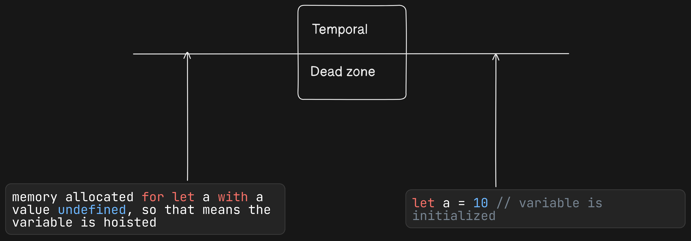
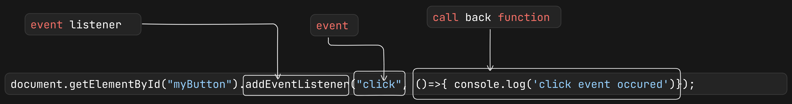

# Javascript interview-questions

## 1. What is Javascript?
Javascript is a high-level, interpreted (execute line by line) programming language, widely used in web development.

## 2. What is the execution context in JavaScript?
Execution context is an environment where the javascript code is executed. It has two sections: memory component (known as variable environment) and code component (threads of execution)

```javascript
var a; // declaring a
console.log(a); // output: undefined
a=10
console.log(a)
```
So when this code runs, then the Global execution context is created and in the memory components first the variable 'a' is allocated with a memory, and the value is set to 'undefined'. 

After memory allocation is done, line-by-line code is executed in the first log 'undefined' will show as it has no other value, then in next line 'a=10', so the log will print as 10


## 3. Types of execution context in JavaScript?
 - Global execution context: It is created when js code starts running, it represents the global scope and global object(e.g window in browser). The 'this' keyword mainly refers to the global object.
 - Functional Execution context: It is created whenever a function is called or invoked. Each function call generates a new execution context. The 'this' keyword within a function context refers to the object that is invoked in that function.
 - Eval execution context: Created when the 'eval' function is used to execute a string of code. This execution context is generally avoided due to security and performance issues.

 ## 4. What is the shortest js program?
 An empty javascript file is the shortest JS program.

 ## 5. Code example of how execution context works.
```javascript
var n=2
function square(num){
    var ans = num * num
    return ans
}
var sq1 = square(n)
var sq2 = square(4)
```
The execution context is created with 2 phases, **Memory creation phase and code execution phase**.
So when this example code starts running, 1st phase, the **memory creation phase** started, so in the code ---

- **n: undefined** // undefined is a special keyword to show that the variable is not empty, but has a special default value.

Next comes the function

- __square: {...}__ // function square(num){
    var ans = num *num
    return ans
}

For function, the whole code is stored in the memory

- **sq1: undefined**
- **sq1: square(n)** // when the function is invoked
- **sq1: 4** // after getting the result from the function and functional execution context is removed automatically

- **sq2: undefined**
- **sq2: square(4)**  // when the function is invoked
- **sq2: 16** // after getting the result from the function and functional execution context is removed automatically

Now the **code execution phase** starts

**var n =2** // now the undefined value will be replaced by the value of n i.e. 2
Then comes the function definition, nothing to do here, so go to the next line

**Now the function invocation or call happens in the line sq1 = square(n), so for function invocation a new mini program starts and a new execution context is created under the global execution context**

In that particular execution context again 2 phases will come memory phase and code execution phase in the result, the **ans variable** returns the value and then the execution context is deleted

**For the next function invocation, the same thing will happen i.e., creation of a new execution context, and after return the result execution context will be deleted**

*Atlast when all the code is executed, then global execution is automatically deleted*


## 6. What is call stack?
When a javascript program starts execution, then a stack is also populated with the global execution context and the global execution context is stored in that stack, also when a function is invoked, then a new execution context is generated and it is placed in the stack. after the function returns its value the execution context will be removed automatically, by **popping** from the stack. When the whole js program execution is completed then the global execution context is also removed from the stack by pop. This stack is called call stack.

*Call stack maintains the execution of the execution contexts*

**Call stack can be known as different names**
- Call stack
- Execution control stack
- Program stack
- Runtime stack
- Machine Stack


## 7. What is hoisting in JavaScript?
Hoisting is a phenomenon/situation in javascript where a variable or function can be accessed before its initialization.

e.g 
```javascript
console.log(x)
get()
var x = 10
function get(){
    console.log('hi')
}
console.log(x)
```
Here in this code, we can easily understand the hoisting

- In the memory allocation phase **x is defined as undefined** and the **get() whole code is stored**
- In the code execution phase console.log(x) is there, here x already has a special value undefined so the undefined prints.
- **In the code execution phase this x variable is not initialized, but in the memory allocation phase we can see x variable has some memory with undefined stored in it. So var is in the global scope, if the variable is declared then the var can be called from anywhere. In this case, the var variable is called before its initialization, so undefined returns.**
- In the case of a function, the whole code is stored during memory allocation time, when the function is called then a new execution context is created, and it has its own memory and code phase. After the function ends its execution, the execution context is also deleted and returns to the global execution context.
- In the last line of code again console.log(x) is written and this time it returns 10 because the variable is already initialized with a new value.


## 8. What is the difference between undefined and not defined?
- When a variable is mentioned in the js code and during the memory allocation phase the variable gets a special type of placeholder/keyword called **undefined**. Before initializing the variable if it needs to print then **undefined** will print.
- When a variable is called in the js code, and that variable is never mentioned in the js code, so the memory allocation did not happen, then we can say that variable is **not defined**. Also, js sends an error message that a particular variable is **not defined**

## 9. Is JS a loosely type / weakly typed language?
Javascript is a loosely typed language because when a variable has some value, that variable does not attach any data type with it.
e.g
```javascript
var a = 10, b ='11'
var a = a + b
console.log(a) //1011
```
So from the example, we can see that a has an integer value of 10, and b has a string value of 11, when the variables concats, then the result makes it a string and it's stored in the variable a. Now the variable has a string type value.

So this variable does not attach any data type with it, this makes the variable flexible to hold different data types of value.

## 10. What is Scope?
Scope means where I can access a specific variable or a function in the code. 

Also when one variable has a specific area where the variable can be accessed that is called the scope of the variable.

## 11. What is lexical environment?
Lexical means in order or in hierarchy or in a sequence.
When an execution context is created a lexical environment is also created. The lexical environment is the local memory space along with the lexical environment of its parent.


## 12. What is the scope chain?
When a variable is searched in a function's local scope, if not found then the variable is searched in its outer/parent function, if not found then it is searched in the global scope. So when a search is going on scope after scope, and every time its searches to its outer scope this is called scope chaining.


## 13. Difference between var, let, const.

    var                                          | let                                               |  const                                          
    -------------------------------------------- | ------------------------------------------------- |------------------------------------------------ 
    1. It is global scope                        | 1. It is in block scope                           | 1. It is in block scope                            
    2. Temporal dead zone does not occur         | 2. Temporal dead zone does occur                  | 2. Temporal dead zone does occur                   
    3. Before initialization variable can be     | 3.Before initialization variable can not be       | 3.Before initialization variable can not be       
      accessed with the value **undefined**      |   a reference error will show that particular     |   a reference error will show that particular     
                                                 |   variable can not be accessed before             |   variable can not be accessed before             
                                                 |   initialization                                  |   initialization                                  
    4. Reassign value is possible                | 4. Reassign value is possible                     | 4. Reassign value is not possible

## 14. What is the difference between == and === operators

JavaScript provides both strict(===, !==) and type-converting(==, !=) equality comparison. The strict operators take the type of variable into consideration, while non-strict operators make type correction/conversion based upon the values of variables. The strict operators follow the below conditions for different types,

1. Two strings are strictly equal when they have the same sequence of characters, the same length, and the same characters in corresponding positions.
2. Two numbers are strictly equal when they are numerically equal, i.e., having the same number value.
    There are two special cases in this,
    1. NaN is not equal to anything, including NaN.
    2. Positive and negative zeros are equal to one another.
3. Two Boolean operands are strictly equal if both are true or both are false.
4. Two objects are strictly equal if they refer to the same Object.
5. Null and Undefined types are not equal with ===, but equal with == .
    i.e, `null===undefined --> false`, but `null==undefined --> true`

Some of the example which covers the above cases:

```javascript
0 == false   // true
0 === false  // false
1 == "1"     // true
1 === "1"    // false
null == undefined // true
null === undefined // false
'0' == false // true
'0' === false // false
NaN == NaN or NaN === NaN // false
[]==[] or []===[] //false, refer different objects in memory
{}=={} or {}==={} //false, refer different objects in memory

function x(a, b){
	if(a === b)
		return "equal"
	else
		return "not equal"
}
console.log(x(10, '10')) // not equal
```

## 15. What is a temporal dead zone?
let and const variable are in a block scope, let and const are also hoisted because in the memory allocation time, this variable also got the memory allocation with undefined stored in the variable, so if a let or const variable is accessed before its initialization, it will show an error that the variable can not access before its initialization, so **the time between hoisted and initialization of the let or const variable is known as temporal dead zone**.
e.g
```javascript
console.log(a) //here error will come with a message that 'a' can not accessed before its initialization, so this means let variable is hoisted, variable can not be accessed
let a = 10 // let variable is initialized
```
so from the example, we can see the time between hoisted and initialization is known as the **Temporal dead zone**


## 16. What is block in javascript?
A block is defined by curly braces, there zero to n numbers of statements can be written. It is also known as a compound statement.
e.g
```javascript
{
    //This is block
}

if(true){
    //This is a block
}
for(;;){
    //This is a block
}
```
When js expects only one statement, but we have many statements, so we need to group all those statements in 1 group or compound statement, for if-else, loops it expects only one statement, but we have many statements, so we group all those statements in a block.

## 17. What is shadowing in JS?
when a variable declared within a certain scope (decision block, method, or inner class) has the same name as a variable declared in an outer scope.
e.g
```javascript
    var a = 10
    let b = 20
    {
        var a = 20
        let b = 100
        console.log(a) // 20
        console.log(b) // 100
    }
    console.log(a) // 20 var is in the global scope so the variable can be accessed from anywhere and can update its value
    console.log(b) // 20 let is in the block scope so outside the scope the same name variable has different memory allocation and scope 
```

## 18. What is closure ?
- Closure means that a function bind together its lexical environment.
- In other words, a function along with its lexical scope bundled together called closure.
- In other words, a closure gives you access to an outer function's scope from an inner function

In JavaScript, closures are created every time a function is created

e.g
```javascript
function makeFunc() {
    const name = "Mozilla";
    function displayName() {
      console.log(name);
    }
    return displayName;
}
  
const myFunc = makeFunc(); //not only the inner function return also the outer scope return i.e closure return, that's why outer scope variable can be accessed
myFunc(); // Mozilla
makeFunc()() // Mozilla


function makeAdder(x) {
    return function (y) {
      return x + y;
    };
}

const add5 = makeAdder(5); //not only the inner function return also the outer scope return i.e closure return, that's why outer scope variable can be accessed
const add10 = makeAdder(10); //not only the inner function return also the outer scope return i.e closure return, that's why outer scope variable can be accessed

console.log(add5(2)); // 7
console.log(add10(2)); // 12
  
console.log(makeAdder(5)(2)); // 7
console.log(makeAdder(10)(2)); // 12
```
## 19. Uses of Closures?
- Module Design Pattern
- Currying
- Function like once
- memoize
- maintaining state in *async* world
- setTimeouts
- Iterators

## 20. What will the output?

```javascript
for(var i=1; i<=5; i++){
    setTimeout(()=>{
        console.log(i) // 6 6 6 6 6
    }, i*1000)
}
```

## 21. What will be the output?

```javascript
for(let i=1; i<=5; i++){
    setTimeout(()=>{
        console.log(i) // 1 2 3 4 5
    }, i*1000)
}
```

## 22. What will be the output?

```javascript
function x () {
    for(var i=1; i<=5; i++){
        function y(i){
            setTimeout(()=>{
                console.log(i) // 1 2 3 4 5
            }, i * 1000)
        }
        y(i)
    }
}
x()
```

## 23. What is function statement in JS?
The way of creating a function, is called function statement. It is also known as **function declaration**.

```javascript
function a(){
    ....
}
```
## 24. What is function expression in JS?
When a function is stored in a variable that is called function expression.

```javascript
var a = function(){
    ....
}
```

## 25. What is the difference between function statement and function expression in JS?
The main diiference is **hoisting**.

In the memory allocation time

- Function statement got its meomry and whole function statement is stored in the memory, so from anywhere you are calling the function the output will come.
- For function expression in memory allocation time the function expession is treated as normal variable, with the value undefined, so before initialization of the variable if I call the variable as a function, it will show error.

## 26 . What is Anonymous Function?
A function without name is called Anonymous Function.

```javascript
	var greet = function () { 
		console.log('Arpan'); 
	}
	
	greet()
```
In this example, we define an anonymous function that prints a message to the console. The function is then stored in the greet variable. We can call the function by invoking greet()

```javascript
setTimeout(function () { 
        console.log('Arpan'); 
    }, 2000); 
```
In this example, we pass an anonymous function as a callback function to the setTimeout() method. This executes this anonymous function 2000ms later.

## 27. Differnce between function parameter and arguments?
- In the function expression or in funtion declaration local variables can be added to get the values which is required by the function that is known as function parameter.
```javascript
function get(param1, parma2){ // function parameters 
    ...
}
```
- When invoking or calling a function we need to send some values which will accept by function parameter, that is known as function argument.
```javascript
get(1, 2) // function arguments
```

## 28. What is first class function?
A function when it is used as value of variable, can be passed as an argument to another function, can be returned from a function, then that function is called first class function.

```javascript
let assign = function sum(x, y) {  
    return x + y;  
}   // function is taken as value of a variable
  
let avg = function avg(x,y, z) {  
    return z(x, y) / 2;  // return a function
}  // function is taken as value of a variable
let res = avg(10, 20, assign);  // function is passed as an argument
console.log(res)
```
The first class functions are the first class citizens and are treated as the first-class object.

## 29. What is higher order function ?
A higher-order function is a function that takes one or more functions as arguments, or returns a function as its result.

```javascript
let assign = function sum(x, y) {  
    return x + y;  
} 
  
let avg = function avg(x,y, z) {  
    return z(x, y) / 2; 
}
let res = avg(10, 20, assign);  // here avg function is higher order function because it takes assign function as an argument also returning it
console.log(res)
```
## 30. Print all numbers between 1 to N without using any loop.
```javascript
function collectNumbers(n, arr) {
    // Base case: if n is 0, stop the recursion
    if (n <= 0) {
        return;
    }
    // Recursively call the function with n-1
    collectNumbers(n - 1, arr);
    // Push the current number to the array
    arr.push(n);
}

const N = 10;
const numbersArray = [];
collectNumbers(N, numbersArray);
console.log(numbersArray); // [1, 2, 3, 4, 5, 6, 7, 8, 9, 10]
```
## 31. Can you freeze a javascript object ?

```javascript
const person = {
  name: 'abc'
}

Object.freeze(person)
person.age = 23
person.name = 'xyz'
console.log(person) // {name: 'abc'}
```
# 32. Compare 2 objects
```javascript
const obj1 = { name: 'John', age: 27}
const obj2 = { name: 'John', age: 27}

console.log(obj1 == obj2) //false
console.log(obj1 === obj2) //false
console.log(JSON.stringify(obj1) == JSON.stringify(obj2)) // true
``` 
## 33. What is callback function?
A function which can be taken as argument to another function that is called call back function.
```javascript

setTimeout(()=> {
    console.log('timer')
}, 2000)

function x(yz){
    console.log('x')
    yz()
}

x(function yz(){
    console.log('y')
})
```
Here the x, y, after 5 sec timer will get printed.

Here yz is the call back function, and under setTimeout parameter another call back function is there.

## 34. What is event listener?
An event listener in JavaScript is a function that waits for an event to occur and then responds to it.

```javascript
document.getElementById("myButton").addEventListener("click", ()=> console.log('click')); // addEventListener() is the event listener and click is the event
```


## 35. Why do we need to remove event listener?
Event listeners are heavy, that means it takes memory. When event listener is attached its kind a form a closure, and even when the call stack is empty, but still event listner not freeing up the memory, because browser don't know when the event will be called. So for this reason when we are not using event listener we should remove that. 

If in a page many event listners are there, and when we are going outside that page we need to remove all those event listeners that holding the memory, to free up the memory, otherwise it will held the memory and make our application slow. This holding the memory concept is called **memory leak**

```javascript
element.addEventListener("mousedown", handleMouseDown, true);
-------
-------
element.removeEventListener("mousedown", handleMouseDown, false); // Fails
element.removeEventListener("mousedown", handleMouseDown, true); // Succeeds
```
The first call fails because the value of useCapture doesn't match. The second succeeds, since useCapture matches up.

Another example
```javascript
const body = document.querySelector("body");
const clickTarget = document.getElementById("click-target");
const mouseOverTarget = document.getElementById("mouse-over-target");

let toggle = false;
function makeBackgroundYellow() {
  body.style.backgroundColor = toggle ? "white" : "yellow";

  toggle = !toggle;
}

clickTarget.addEventListener("click", makeBackgroundYellow, false);

mouseOverTarget.addEventListener("mouseover", () => {
  clickTarget.removeEventListener("click", makeBackgroundYellow, false);
});

```
## 36. What is window object ?
The window object in JavaScript represents the browser window or frame. Window object is in the global scope of the javascript. So using this object we can access webapi, dom apis, console log, fetch(), geolocation, localstorage etc.

## 37. What is event loop?
Event loop has one job, its just continuously monitoring **call stack**, **callback queue**, and **microtask queue**. When the call stack is empty event loop checks the **callback queue** and **microtask queue** for any function present in there or not. If any function present in the call back queue or **microtask queue**, event loop will send the function to the call stack.

**Microtask queue** has ***higher priority*** than **callback queue**, so when call stack is empty event loop first check the **microtask queue**, if **microtask queue** is empty then checks the **callback queue**.

So event loop is just like a gate keeper between call stack and **callback queue**, **microtask queue**.

*Which callback function go to microtask queue?*
All the callback function which comes through **promises** will go inside **microtask queue**. There is another thing known as **mutation observer**, it basically alwasys checks is there any kind of mutation/changes happend in the DOM tree or not. If some mutation happened in the DOM tree, then **mutation observer** executes some callbacks and that callbacks goes to the **microtask queue**.

*Which callback functions go to callback queue?*
All the callbacks coming from the **setTimeout()**or the **DOM apis** will go the **callback queue**

***callback queue are also known as task queue, evemt queue***


## 38. What is starvation?
Microtask queue has the higher priority than callback queue, so event loop checks first in the microtask queue, and if there are lot of callback functions are there, so one by one that functions will go to the call stack for execution in FIFO order. 
In the mean time callback queue also has some callback functions waiting to go to the call stack but it could not go because until the microtask queue is empty till then event loop will not pass any callback queue from the callback queue. This situation is called **starvation** of the tasks in the **callback queue**.

## 39. How to get this output?

```javascript
const arr = [5, 1, 3, 2, 6]
//transform the array elements in binary ['101', '1', '11', '10', '110']
const output = arr.map(item => item.toString(2))
console.log(output) // ['101', '1', '11', '10', '110']

```

## 40. Difference in map. filter and reduce method?

1. **map** method is used when we want transformation of whole array.
2. **filter** is used when we want to filter the arrar to obtain required value.
3. **reduce** is used when we want to reduce the array to single value eg (max, min, avg, sum, difference etc). reduce passes two arguments one function(which includes accumulator and initial value as argument itself) and another initial value of accumulator.

